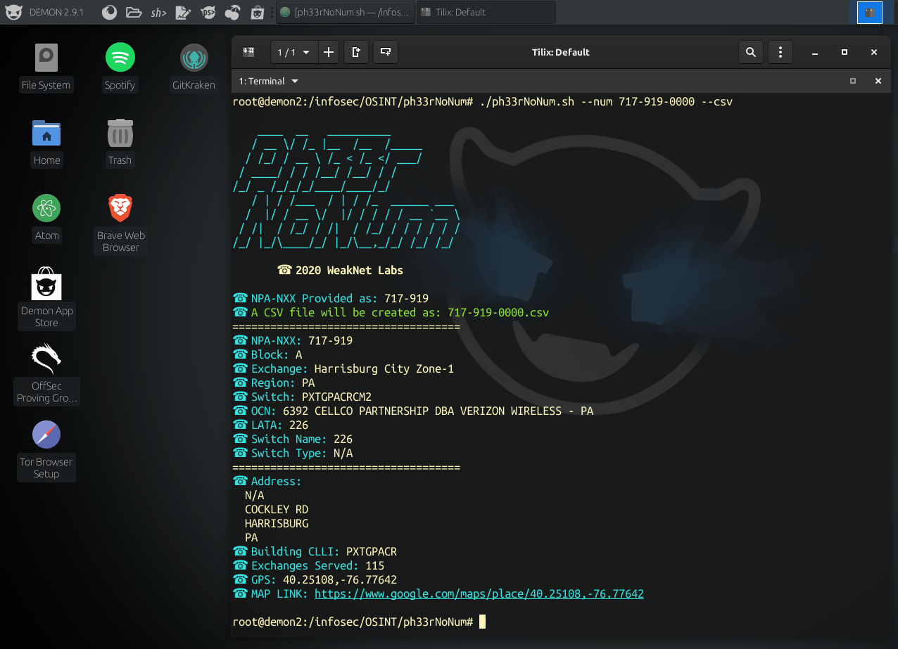

# ph33rNoNum
Ph33r No Number - OSINT Script that will consume OSINT resources as HTML to look for information pertaining to a suspicous (US only, for now) phone number.


***Figure 0: A screenshot of ph33rNoNum.sh running in Demon Linux (http://demonlinux.com)***
## Usage
Download the latest version using git and chnage the file permissions to execute it. Example:
```
git clone https://github.com/weaknetlabs/ph33rNoNum.git
cd ph33rNoNum
chmod +x ph33rNoNum.sh
./ph33rNoNum.sh --num XXX-XXX-XXXX --csv
```
### CSV
You can optionally add `--csv` to have a coimma separated value file created with the reposnes from the online resources.

## OSINT Resources Consumed
The following is a current list of all OSINT resources comsumed by this program. 
 * https://localcallingguide.com
 * https://www.telcodata.us
 * https://www.cyberbackgroundchecks.com
 * https://zabasearch.com
 
## Privacy
This script is open sourced, check for yourself. There is no code that collects your input, but I am not responsible for the services consumed to gather the information - which just uses the NPA-EXC part of the phone number anyways. If you are really worried, try to simply input `NPA-EXC-0000` for instance: `412-885-0000` as per the exmaple from the screenshot above. 412-885-0075 is a cool test number that I found from the Tuxedo switch back in my phreaking days that still remains.
